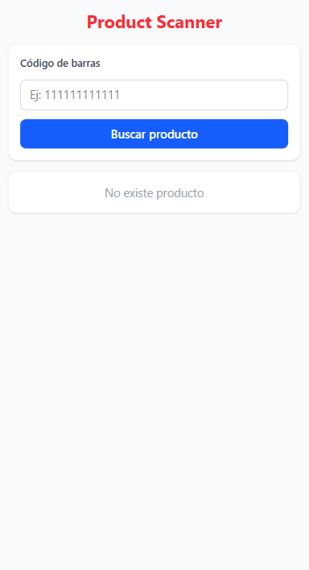
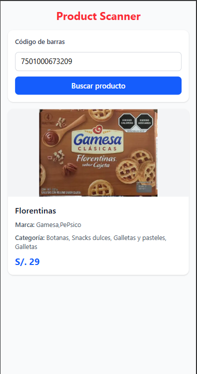
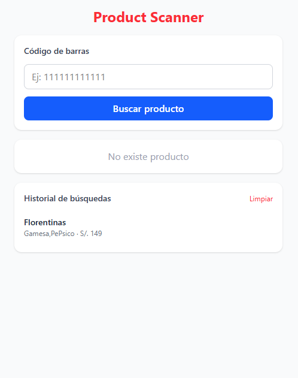
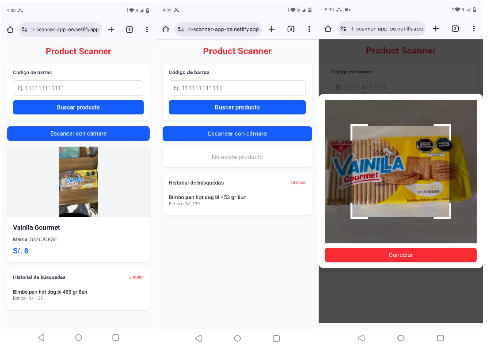

# Product Scanner App

## Reto Técnico – Product Scanner App

Aplicación web desarrollada con **Next.js** que permite buscar productos mediante código de barras y mostrar información relevante del producto.  
El proyecto simula un flujo real de escaneo/búsqueda de productos con una interfaz limpia, moderna y enfocada en mobile-first.

La información del producto se obtiene desde la API pública de **OpenFoodFacts** y el precio se genera de forma simulada.

---

## Tecnologías Utilizadas

- **Next.js 14+** (App Router)
- **React 18**
- **TypeScript**
- **Tailwind CSS**

---

## Funcionalidades Principales

- Búsqueda de productos por código de barras
- Validación de códigos (6 a 13 dígitos)
- Consulta a API externa (OpenFoodFacts)
- Visualización de información del producto
- Precio simulado (S/. 5 – 150)
- Historial de búsquedas persistente (localStorage)
- Diseño responsive mobile-first

---

## Instalación y ejecución local

Sigue estos pasos para ejecutar el proyecto en tu máquina local.

### Clonar el repositorio

```bash
git clone https://github.com/sergiobazan/product-scanner-app
cd product-scanner-app
```

### Instalar dependencias

```bash
npm install
```

---

## Configuración del Entorno

Para que la aplicación pueda realizar consultas a la API de productos, es necesario crear un archivo de variables de entorno.

### Crear el archivo `.env.local`

En la raíz del proyecto, crear el archivo:

```txt
.env.local
```

Agregar la variable de entorno:

```env
NEXT_PUBLIC_API_URL=https://world.openfoodfacts.org/api/v0/product
```

### Ejecutar el proyecto en desarrollo

```bash
npm run dev
```

---

## Demo y Capturas

La aplicación se encuentra desplegada en **Netlify** y puede probarse en el siguiente enlace:

**Demo:** <https://product-scanner-app-oe.netlify.app/>

Además, se incluye un enlace con capturas de pantalla del flujo principal de la aplicación:

**Screenshots**:

### Pantalla inicial



### Resultado de búsqueda Producto



### Historial de busqueda



### Escanner de producto



## Autor

Desarrollado por **Sergio Bazan**
